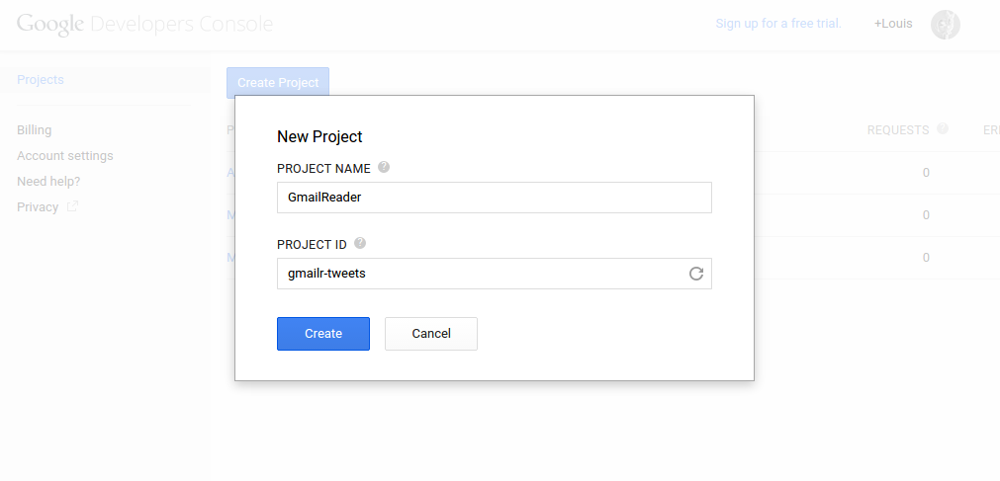
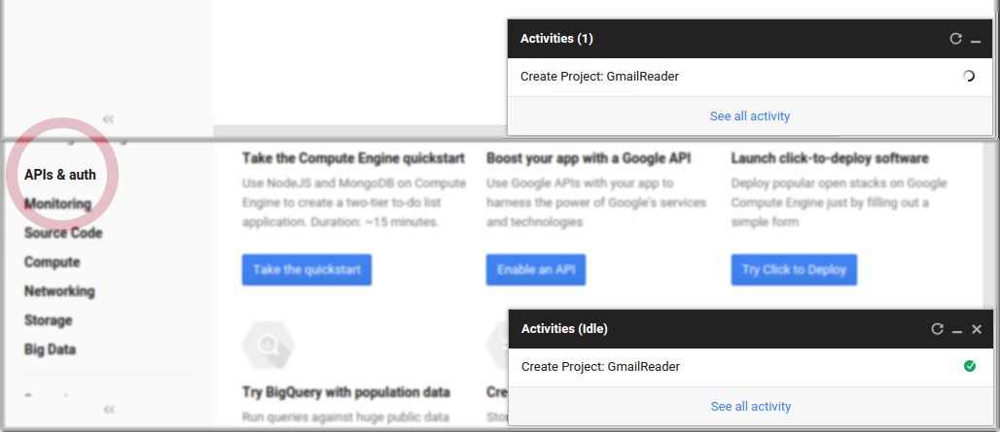
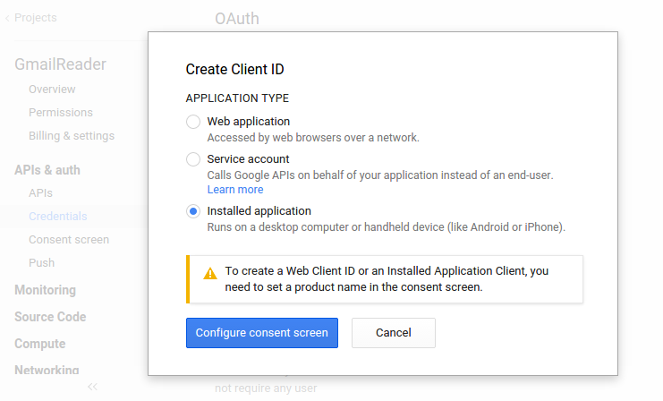
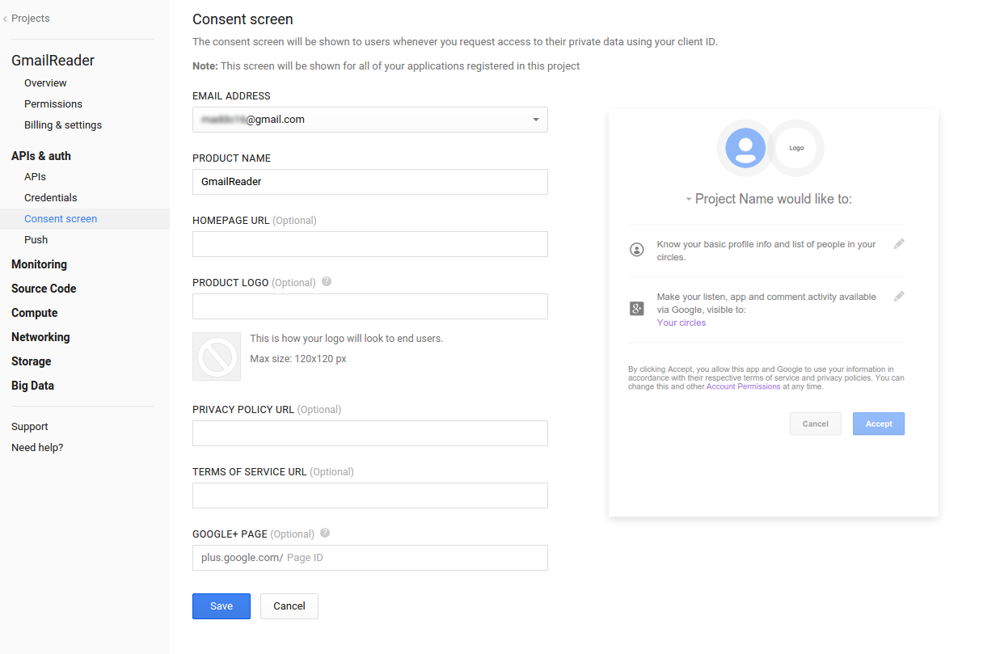
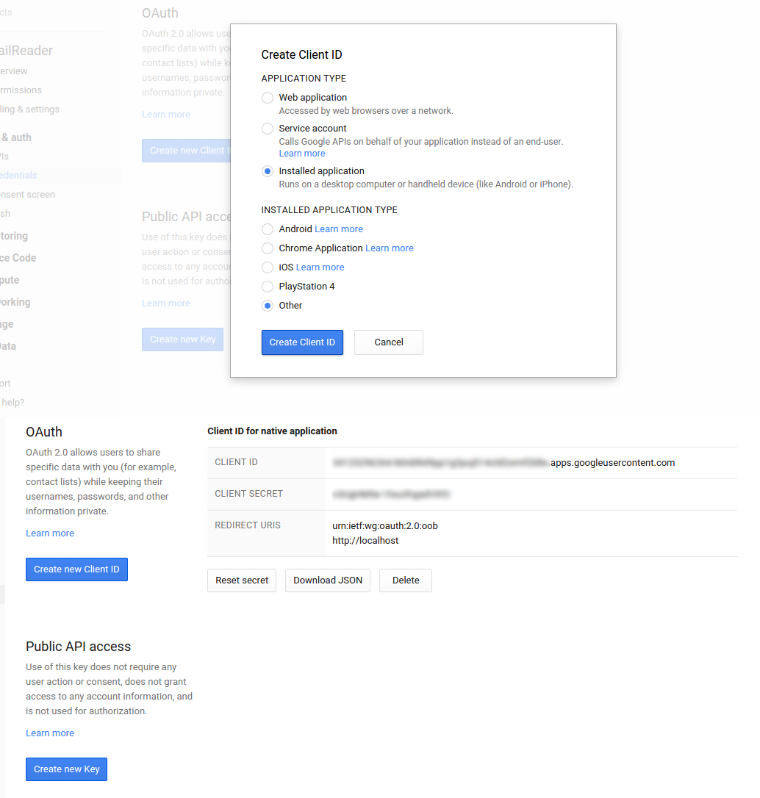
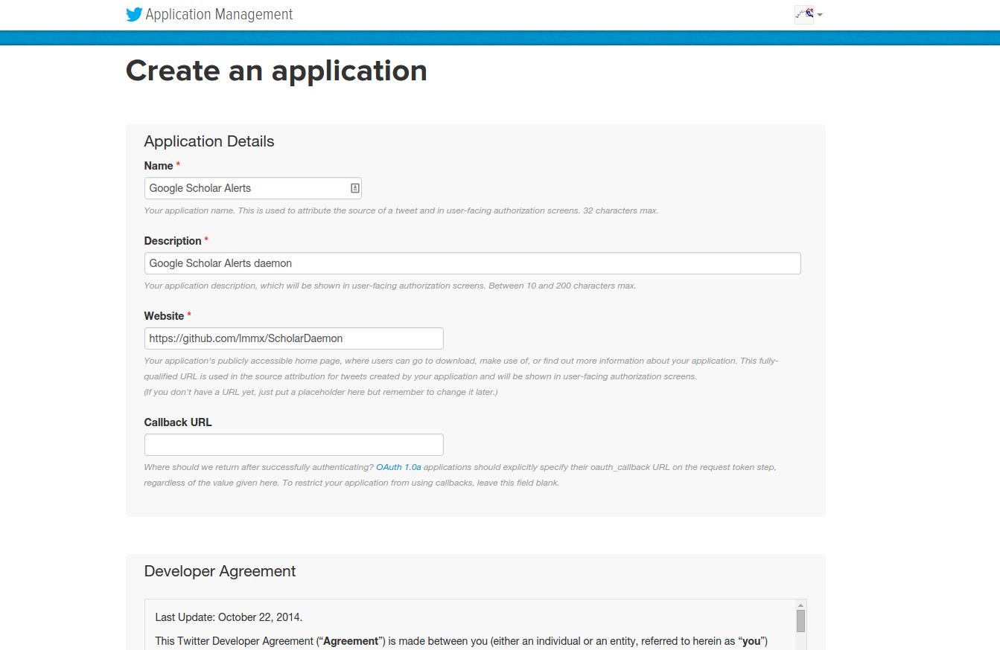

## :mag_right: :hatched_chick: :page_with_curl: Google Scholar Alerts Twitter bot :page_with_curl: :hatched_chick: :mag_right:

Google Scholar lacks an API, but unlike PubMed **links directly to papers**. Often the stream of a Pubmed-sourced bot is filled with papers not deposited with direct links. *Occasionally* they will have a DOI, but Medline's indexing of these is inconsistent (the XML for articles themselves can be pretty inconsistent as I found out on [a previous excursion under Pubmed's bonnet](https://github.com/lmmx/watir-paper-scanner)).

Even when a paper is deposited with this identifier, the DOI minting process means it's not guaranteed that the link will work straight away - I myself have felt (and regularly see other scientists online expressing the same) frustration at having the basic line of scientific enquiry rudely interrupted by technical issues. Preprints are another consideration.

[](http://arxiv.org/year/q-bio/13) <small>*[via](https://twitter.com/nextgenseek/status/422713358668668929)*</small>

> Preprints are undeniably [coming into the fold of bioscience research](https://www.youtube.com/watch?v=G1ffCDBPiOA), a practice originating in the physics/mathematical sciences that [crept in through common ground](https://twitter.com/leonidkruglyak/status/335422823025741826) at arXiv's [q-bio](http://arxiv.org/archive/q-bio) section. There are various dedicated sites/accounts monitoring particular subfields (e.g. [Haldane's sieve](haldanessieve.org)/@[haldanessieve](https://twitter.com/haldanessieve) for population/evolutionary genetics).
>
> Google Scholar indexes all fields, and in my own experience this leads to casual interdisciplinary reading in a way not possible from Pubmed's purely biomedical library - a facet of research which the [*BBSRC*, *MRC* and the *Society of Biology* feel is lacking amongst bioscientists](http://www.bbsrc.ac.uk/news/people-skills-training/2015/150204-n-report-vulnerable-research-skills-capabilities.aspx).

### Creating a feed of interest through Google Scholar

* Google Scholar Alerts can provide up to 20 results in an e-mail, and posting/archiving these somewhere other than a busy inbox makes new research more accessible
* Gmail for instance has various APIs and libraries, including an [official Python 2.6-2.7 package](https://developers.google.com/api-client-library/python/apis/gmail/v1) and [`gmailr`](https://github.com/jimhester/gmailr) for R
* Twitter likewise has [`python-twitter`](https://github.com/bear/python-twitter) and [`twitteR`](https://github.com/geoffjentry/twitteR)

This script checks for Google Scholar Alerts in a Gmail account, parses through the message for paper titles and links, and sends the list of new articles through to Twitter

* this could perhaps be automated with a cron job like Lynn Root used for her [*IfMeetThenTweet*](https://github.com/econchick/IfMeetThenTweet/) IFTTT alternative
* it could also perhaps be hosted on a free micro instance of Amazon Web Services EC2 (but I've not tried yet) *etc.*
* sending the papers to [Buffer](https://bufferapp.com/guides) doesn't make much sense since it seems to be at most 1 email a day, though perhaps other queries may vary

### 1: Gmail checker

```r
install.packages('gmailr')
library('gmailr')
```

To access your mail with `gmailr`, even for personal use, first register a new project at https://cloud.google.com/console#/project



After a short wait you can switch the Gmail API on from the sidebar under *API*, then `Create new client ID` under *Credentials*.



While Twitter is accessed through the web, the script will be locally hosted (for now at least), so choose the option *Installed application*:



...select your email and name the 'application'



...go with the defaults, and JSON is ready to download



This downloaded JSON serves as input to the `gmail_auth()` function, which I renamed `gmail_authfile.json` and added to my working directory.


```r
gmail_auth('gmail_authfile.json')
```

<pre>Use a local file to cache OAuth access credentials between R sessions?
1: Yes
2: No

Selection: 1

Adding .httr-oauth to .gitignore
httpuv not installed, defaulting to out-of-band authentication
Please point your browser to the following url: 

  https://accounts.google.com/o/oauth2/auth?client_id=...apps.googleusercontent.com&scope=https%3A%2F%2Fwww.googleapis.com%2Fauth%2Fgmail.readonly&redirect_uri=urn%3Aietf%3Awg%3Aoauth%3A2.0%3Aoob&response_type=code

Enter authorization code:</pre>

Go ahead and add `*.json` to the `.gitignore` if you're versioning this, authorise the ability to read email, and enter the code provided.

The `gmailr` package deals with message IDs and thread IDs, while to read an email would need access to the content (rather than this 'metadata' accession ID). The package vignette only documents the outbound side of things, but the README highlights the `messages()` search function, and a glance over the [source code](https://github.com/jimhester/gmailr/blob/master/R/message.R) shows you retrieve an individual message content with `message('<message ID>')`.

The complexity is solved with some functions I've written in the R script here, so just go ahead and source after reading these notes to go through the setup:

<big><big><big>`source('ScholarDaemon.R')`</big></big></big>

The `twitteR` package the script will try to load should be downloaded off of my fork as (at present) the pull request to allow bypassing a hard-coded 140 characters (without taking URL shortening into account) hasn't been accepted into Geoff Jentry's original repo.

```r
# install.packages(c("devtools", "rjson", "bit64", "httr"))
library('devtools')
# install_github("twitteR", username="geoffjentry")
# Install from my fork until PR is accepted
install_github("lmmx/twitteR")
library('twitteR')
```

Further details on what's going on in the `ScholarDaemon.R` script are below.

```r
scholar.alerts <- messages('Scholar Alert')
# the message IDs are stored in a 'gmail_messages' class - a list
# num.msgs <- scholar.alerts[[1]][['resultSizeEstimate']]
msg.list <- scholar.alerts[[1]][['messages']]
```

Each 'message' in this structure is listed alongside its thread ID, and a message is retrieved with format *full*, *minimal*, or *raw*. For the purposes of grabbing the links to new articles full is best, *e.g.* for the most recent Scholar Alert in my inbox:

```r
eg.msg.resp.full <- message(eg.msg.id, format = "full")
eg.msg.resp.full.data <- eg.msg.resp.full$payload$body$data
```

The 'full' data of `eg.msg.resp.full.data` contains a comparable HTML 'payload' to 'raw' data, but the raw [RFC 2822](https://tools.ietf.org/html/rfc2822) format is less easily taken apart than JSON serialisation - there's [a brief note on this](https://github.com/lmmx/ScholarDaemon/wiki/Note-on-RFC-2822) over in the Wiki.

###2: Message parsing

There are two kinds of Google Scholar Alert: citations of a particular paper (which I won't use here) and custom results for a search query - I currently have one set up to keep an eye on *microRNA oscillation* literature, and can filter the Scholar Alerts in my inbox for solely these with:

```r
scholar.alerts.mo <- messages('Scholar Alert microRNA oscillation')
mo.msg.list <- scholar.alerts.mo[[1]][['messages']]
eg.msg.id <- mo.msg.list[[1]][['id']]
```

Then proceed as above, but building a list of new papers by parsing the HTML with R's `XML` package:

```r
eg.msg.resp.data <- message(eg.msg.id, format = "full")$payload$body$data
eg.msg.html <- gsub('\r\n','',Base64URL_Decode_To_Char(eg.msg.resp.data))

library('XML')
mail.doc <- htmlParse(eg.msg.html, asText=TRUE, encoding = "UTF-8")
mail.root <- xmlRoot(mail.doc)
# See the XML package vignette for details: http://www.omegahat.org/RSXML/Tour.pdf
 
article.list <- xmlElementsByTagName(mail.root[["body"]][["div"]],"h3")

article.summaries <- lapply(article.list, GetPaper)
names(article.summaries) <- NULL
```

<pre>> article.summaries
[[1]]
[[1]]$title
[1] "A Dicer-miR-107 Interaction Regulates Biogenesis of Specific miRNAs Crucial for Neurogenesis"

[[1]]$url
[1] "http://www.sciencedirect.com/science/article/pii/S153458071400834X"


[[2]]
[[2]]$title
[1] "Notch in memories: Points to remember"

[[2]]$url
[1] "http://onlinelibrary.wiley.com/doi/10.1002/hipo.22426/abstract"


[[3]]
[[3]]$title
[1] "Glucocorticoids and 11β-hydroxysteroid dehydrogenases: mechanisms for hypertension"

[[3]]$url
[1] "http://www.sciencedirect.com/science/article/pii/S1471489215000065"</pre>

### 3: Tweeting papers

### 3.1: Write some strings

Twitter's 140 character limit makes an exception for links, which are always counted at *up to* 23 characters, leaving a 116 character limit after a space. To indicate truncation it's standard to use three full stops, but better yet a single-character ellipsis ([U+2026](http://www.fileformat.info/info/unicode/char/2026/index.htm)), gives at least a 115 character limit.

For a domain-specific 'bot', I figured it makes sense to at least attempt to maximise the information provided through abbreviation. For example, "MicroRNA" to "miRNA", or for an intrinsically disordered protein feed, "IDP", *etc.*

A function `AbbrevTitles` shortens repeatedly from a dictionary of common abbreviations (`abbrev.list`) until within the character limit, and this can be called across the list of titles with associated link URLs to generate tweets, as implemented in the `WriteTweet` function. The source code is pretty over-commented, [available online here](https://github.com/lmmx/ScholarDaemon/blob/master/ScholarDaemon.R).

```r
abbrev.list <- list( microRNA = "miRNA",
                    "three-dimensional" = "3D",
                    "intrinsically disordered protein" = "IDP",
                    "intrinsically disordered region" = "IDR",
                    "double-stranded RNA" = "dsRNA",
                    "double-stranded DNA" = "dsDNA",
                    "single-stranded RNA" = "ssRNA",
                    "single-stranded DNA" = "ssDNA",
                    "RNA binding protein" = "RBP",
                    "DNA binding protein" = "DBP",
                    "RNA-sequencing" = "RNAseq",
                    "ribosomal RNA" = "rRNA",
                    "messenger RNA" = "mRNA",
                    "non-coding RNA" = "ncRNA",
                    "Escherichia coli" = "E. coli",
                    ribonuclease = "RNAse",
                    "nuclear magnetic resonance" = "NMR",
                    regulation = "reg.",
                    knockout = "k/o",
                    "protein-protein interaction" = "PPI",
                    "et cetera" = "etc"
)
```

With the above (default) dictionary, a paper entitled "*A detailed three-dimensional structural analysis of the interaction of ribonuclease III with ribosomal RNA in Escherichia coli*" would be abbreviated as:

```r
AbbrevTitle(eg.title)
# [1] "A detailed 3D structural analysis of the interaction of RNAse III with rRNA in E. coli"
```

The `max.compact` parameter makes the title as compact as possible. If specified as `FALSE`, the title will only be shortened to fit within the character limit (though this potentially leads to arbitrary abbreviation of some words over others, hence default behaviour is to use all known abbreviations). If it still runs over the limit, it's truncated with '…'.

```r
eg.title <- "A detailed three-dimensional structural analysis of the interaction of ribonuclease III with ribosomal RNA in Escherichia coli"
AbbrevTitle(eg.title, max.compact = FALSE)
# [1] "A detailed 3D structural analysis of the interaction of ribonuclease III with ribosomal RNA in Escherichia coli"
```

The function to write a tweet is quite simple, taking a title and a URL, abbreviating the title where possible and cutting it short if needed to fit within the character limit. The result of calling this across the list of all papers found in a Scholar Alerts email(s) in a `messages()` search query to the Gmail API is a simple character vector of tweet-ready text:

```r
new.tweets <- as.vector(unlist(lapply(new.summaries, function(message) {sapply(message, WriteTweet)})))
```

<pre>> tweets
[1] "A Dicer-miR-107 Interaction Regulates Biogenesis of Specific miRNAs Crucial for Neurogenesis http://www.sciencedirect.com/science/article/pii/S153458071400834X"
[2] "Notch in memories: Points to remember http://onlinelibrary.wiley.com/doi/10.1002/hipo.22426/abstract"
[3] "Glucocorticoids and 11β-hydroxysteroid dehydrogenases: mechanisms for hypertension http://www.sciencedirect.com/science/article/pii/S1471489215000065"</pre>

### 3.2: Option 1: Send papers to Twitter

[`twitteR`](https://github.com/geoffjentry/twitteR) has a few dependencies obtained with:

```r
install.packages(c("devtools", "rjson", "bit64", "httr"))
```

Then authorise a new application in the [Twitter developer console](https://apps.twitter.com), which requires you to [verify a mobile number](https://twitter.com/settings/devices). Make sure to turn off the text notifications, which are all on by default.



* Modify permissions to read and write
* In the *Keys and Access Tokens* tab, obtain the API 'key' and 'secret' (and generate a token on the same page, as the key and secret may not work).

#### Automate the storage of credentials with `CreateTwitterAuthFile()`

The default parameter for `authfile.name` is 'twitter_authfile.json', and after prompts the file is stored in the working directory.

* `TwitterAuth()` wraps `setup_twitter_oauth` to authenticate using the same file (again a different file can be specified with the `authfile.name` parameter).
* See the [wiki page for manual authenication details](https://github.com/lmmx/ScholarDaemon/wiki/Manual-authentication-details), but the R code `source`'d above should take care of things with the function `CreateTwitterAuthFile()`. I've tried to make the setup method fairly interactive.
* To write a tweet uses the `updateStatus()` function, modified to take [t.co URL shortening](https://dev.twitter.com/overview/t.co) into account with `abbrevTitles()` before passing a tweet to the API call.

As well as the core `text` parameter which is all this script uses, a `mediaPath` can also be passed to `updateStatus`, so pictures such as graphical abstracts could potentially be supplied this way. You can also `searchTwitter`, `getUser`, `twListToDF`, `userTimeline`, `homeTimeline` - see the `twitteR` [vignette](http://geoffjentry.hexdump.org/twitteR.pdf) for full details.
